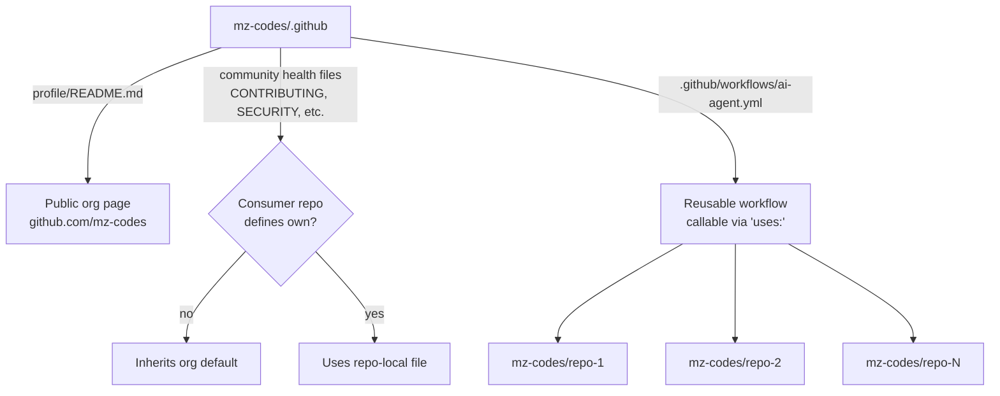

# mz-codes/.github

This repository is the **organization-level `.github` repo** for the [`mz-codes`](https://github.com/mz-codes) GitHub organization. GitHub gives this special repository a privileged role: files placed here can act as defaults for every repository in the org, and the `profile/README.md` is rendered as the public org landing page.

## Purpose

The `.github` repo at the org level serves three jobs:

1. **Public profile** — `profile/README.md` is shown on https://github.com/mz-codes as the org's public face.
2. **Default community health files** — `CONTRIBUTING.md`, `SECURITY.md`, `SUPPORT.md`, `CODE_OF_CONDUCT.md`, `ISSUE_TEMPLATE/`, and `PULL_REQUEST_TEMPLATE.md` placed here are inherited by every repo in the org that does not define its own version.
3. **Reusable workflows** — workflows under `.github/workflows/` can be referenced from any other `mz-codes` repo via `uses: mz-codes/.github/.github/workflows/<name>.yml@<ref>`.

## Repository contents

Current inventory:

| Path | Purpose |
| --- | --- |
| `profile/README.md` | Public landing content rendered on the org page. |
| `.github/workflows/ai-agent.yml` | Reusable workflow that runs `mz-codes/mz-ai-agent-action` on demand via `workflow_dispatch`. Accepts `provider`, `prompt`, `model`, `extra-options`, and `timeout-minutes`. Consumes the `AI_AGENT_CREDENTIALS` org secret. |
| `README.md` | This file — documents the repo itself (not shown on the org profile). |

> Note: only files under `profile/` feed the public org page. The root `README.md` is repo documentation for maintainers.

## How files cascade across `mz-codes` repos

GitHub's fallback rules apply per-file: if a consumer repo defines its own version, it wins; otherwise the org-level file is used. Reusable workflows are opt-in — a consumer repo must explicitly `uses:` them.



## Adding a new shared file

1. **Community health file** — drop it at the repo root (or under `.github/` / `profile/` per [GitHub's docs](https://docs.github.com/en/communities/setting-up-your-project-for-healthy-contributions)). It applies automatically to repos that lack their own version.
2. **Reusable workflow** — add it under `.github/workflows/` with `on: workflow_call` (or `workflow_dispatch` for manual runs), then reference it from consumer repos:
   ```yaml
   jobs:
     run:
       uses: mz-codes/.github/.github/workflows/ai-agent.yml@dev
       secrets: inherit
   ```
3. **Profile change** — edit `profile/README.md`; the org page updates on push to the default branch.

## Default branch

The default branch is `dev`. Open PRs against `dev`; do not push directly.
